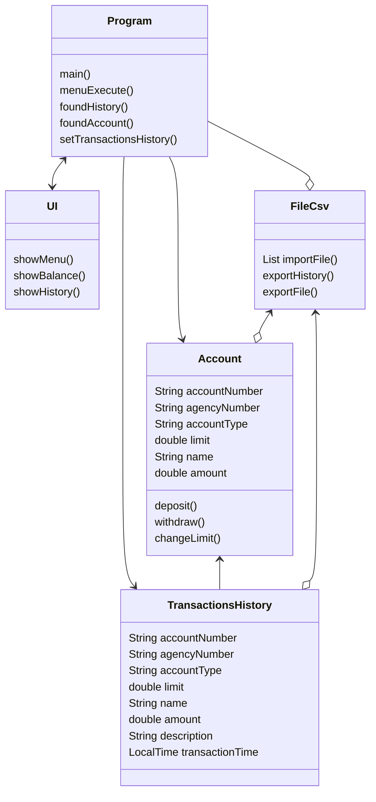

# renewjava01

```mermaid
classDiagram

Program <--> UI
Program --> Account
Program --> TransactionsHistory
Program --o FileCsv

Account <-- TransactionsHistory
FileCsv <--o Account
FileCsv <--o TransactionsHistory


Program : main()
Program : menuExecute()
Program : foundHistory()
Program : foundAccount()
Program : setTransactionsHistory()

Account : String accountNumber
Account : String agencyNumber
Account : String accountType
Account : double limit
Account : String name
Account : double amount
Account : deposit()
Account : withdraw()
Account : changeLimit()

TransactionsHistory : String accountNumber
TransactionsHistory : String agencyNumber
TransactionsHistory : String accountType
TransactionsHistory : double limit
TransactionsHistory : String name
TransactionsHistory : double amount
TransactionsHistory : String description
TransactionsHistory : LocalTime transactionTime

FileCsv
FileCsv : List<Account> importFile()
FileCsv : exportHistory()
FileCsv : exportFile()

UI : showMenu()
UI : showBalance()
UI : showHistory()

```
