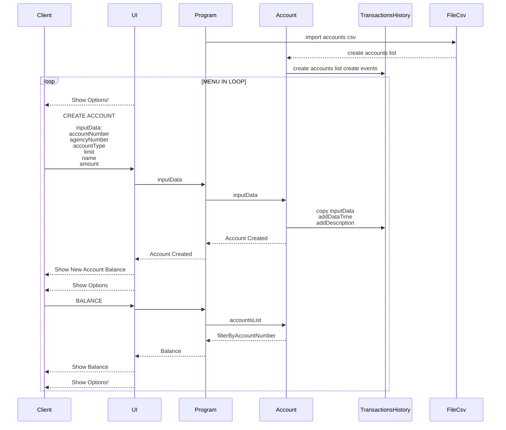
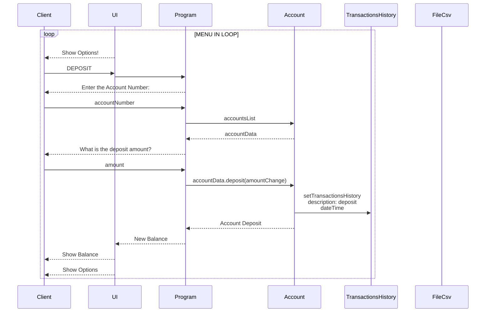
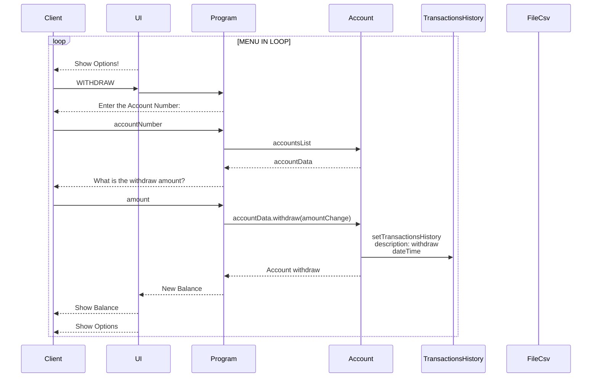
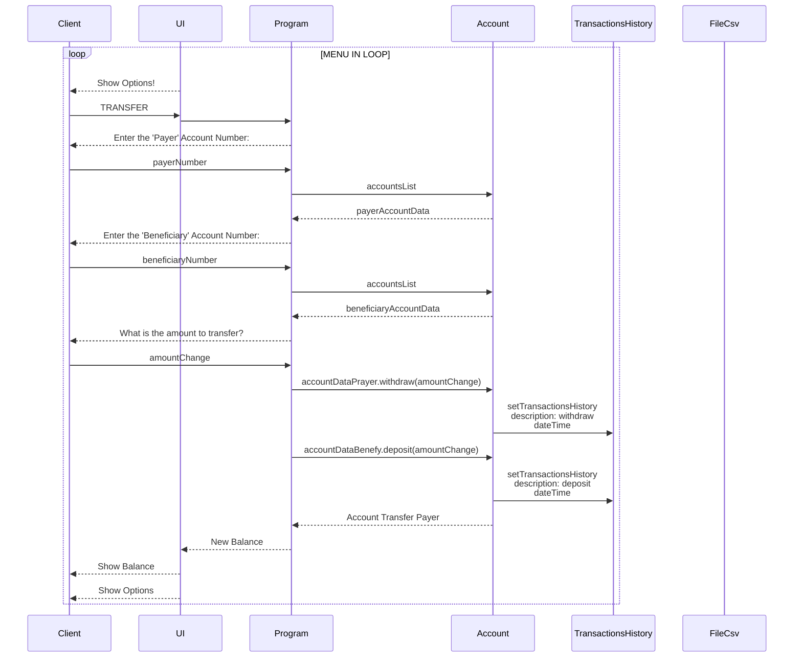
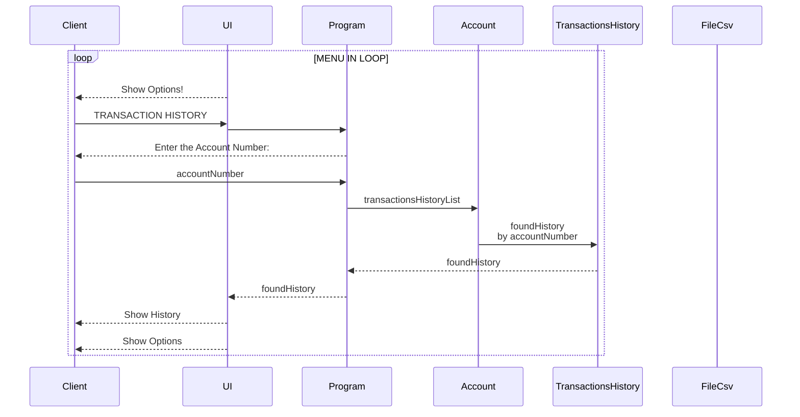
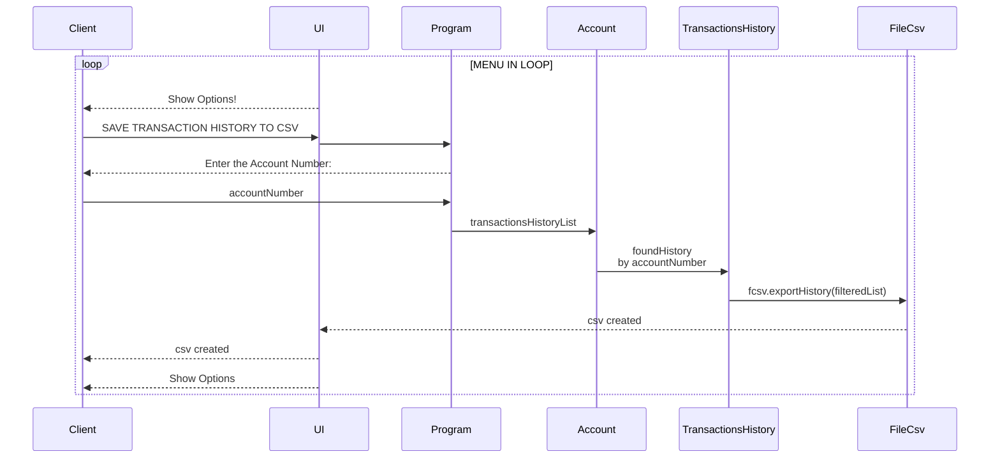
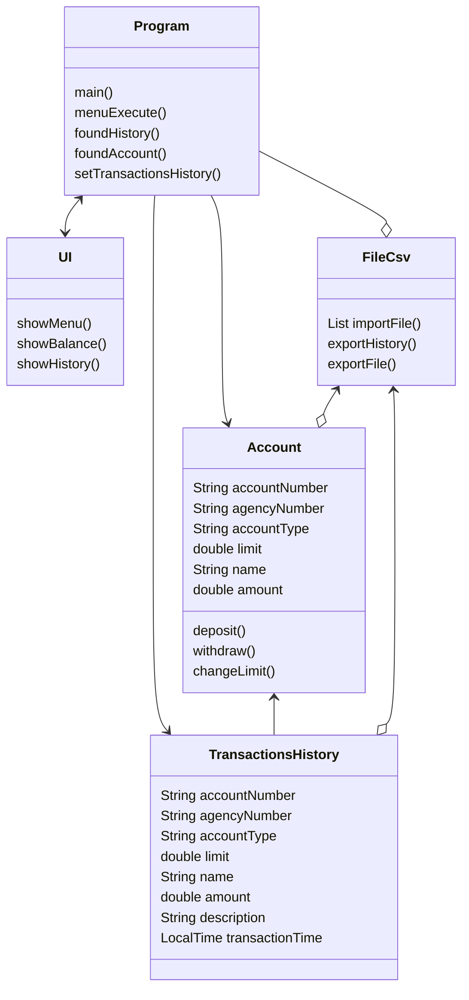

# renewjava01
## Sequence Diagram

```mermaid
sequenceDiagram
participant Client
participant UI
participant Program

participant Account
participant TransactionsHistory
participant FileCsv
    
Program->>FileCsv: import accounts csv
FileCsv-->>Account: create accounts list
Account->>TransactionsHistory: create accounts list create events

loop MENU IN LOOP
UI-->>Client: Show Options!

Client->>UI: CREATE ACCOUNT<br><br>inputData:<br>accountNumber<br>agencyNumber<br>accountType<br>limit<br>name<br>amount
UI->>Program: inputData
Program->>Account: inputData
Account->>TransactionsHistory: copy inputData<br>addDataTime<br>addDescription
Account-->>Program: Account Created
Program-->>UI: Account Created
UI-->>Client: Show New Account Balance
UI-->>Client: Show Options

Client->>UI: BALANCE
UI->>Program: 
Program->>Account: accountsList
Account-->>Program: filterByAccountNumber
Program-->>UI: Balance
UI-->>Client: Show Balance
UI-->>Client: Show Options!

end     
```

```mermaid
sequenceDiagram
participant Client
participant UI
participant Program

participant Account
participant TransactionsHistory
participant FileCsv
    
loop MENU IN LOOP
UI-->>Client: Show Options!

Client->>UI: DEPOSIT
UI->>Program: 
Program-->>Client: Enter the Account Number:
Client->>Program: accountNumber
Program->>Account: accountsList
Account-->>Program: accountData
Program-->>Client: What is the deposit amount?
Client->>Program: amount
Program->>Account: accountData.deposit(amountChange)
Account->>TransactionsHistory: setTransactionsHistory<br>description: deposit<br>dateTime
Account-->>Program: Account Deposit
Program-->>UI: New Balance
UI-->>Client: Show Balance
UI-->>Client: Show Options

end
```

```mermaid
sequenceDiagram
participant Client
participant UI
participant Program

participant Account
participant TransactionsHistory
participant FileCsv
    
loop MENU IN LOOP
UI-->>Client: Show Options!

Client->>UI: WITHDRAW
UI->>Program: 
Program-->>Client: Enter the Account Number:
Client->>Program: accountNumber
Program->>Account: accountsList
Account-->>Program: accountData
Program-->>Client: What is the withdraw amount?
Client->>Program: amount
Program->>Account: accountData.withdraw(amountChange)
Account->>TransactionsHistory: setTransactionsHistory<br>description: withdraw<br>dateTime
Account-->>Program: Account withdraw
Program-->>UI: New Balance
UI-->>Client: Show Balance
UI-->>Client: Show Options

end
```

```mermaid
sequenceDiagram
participant Client
participant UI
participant Program

participant Account
participant TransactionsHistory
participant FileCsv
    
loop MENU IN LOOP
UI-->>Client: Show Options!

Client->>UI: "CHANGE LIMIT
UI->>Program: 
Program-->>Client: Enter the Account Number:
Client->>Program: accountNumber
Program->>Account: accountsList
Account-->>Program: accountData
Program-->>Client: What is the new Limit?
Client->>Program: amountChange
Program->>Account: accountData.changeLimit(amountChange)
Account->>TransactionsHistory: setTransactionsHistory<br>description: changeLimit<br>dateTime
Account-->>Program: Account Limit
Program-->>UI: New Balance
UI-->>Client: Show Balance
UI-->>Client: Show Options


end

```

```mermaid
sequenceDiagram
participant Client
participant UI
participant Program

participant Account
participant TransactionsHistory
participant FileCsv
    
loop MENU IN LOOP
UI-->>Client: Show Options!

Client->>UI: TRANSFER
UI->>Program: 
Program-->>Client: Enter the 'Payer' Account Number:
Client->>Program: payerNumber
Program->>Account: accountsList
Account-->>Program: payerAccountData

Program-->>Client: Enter the 'Beneficiary' Account Number:
Client->>Program: beneficiaryNumber
Program->>Account: accountsList
Account-->>Program: beneficiaryAccountData

Program-->>Client: What is the amount to transfer?
Client->>Program: amountChange
Program->>Account: accountDataPrayer.withdraw(amountChange)
Account->>TransactionsHistory: setTransactionsHistory<br>description: withdraw<br>dateTime
Program->>Account: accountDataBenefy.deposit(amountChange)
Account->>TransactionsHistory: setTransactionsHistory<br>description: deposit<br>dateTime

Account-->>Program: Account Transfer Payer
Program-->>UI: New Balance
UI-->>Client: Show Balance
UI-->>Client: Show Options


end

```

```mermaid
sequenceDiagram
participant Client
participant UI
participant Program

participant Account
participant TransactionsHistory
participant FileCsv
    
loop MENU IN LOOP
UI-->>Client: Show Options!

Client->>UI: TRANSACTION HISTORY
UI->>Program: 
Program-->>Client: Enter the Account Number:
Client->>Program: accountNumber
Program->>Account: transactionsHistoryList
Account->>TransactionsHistory: foundHistory<br>by accountNumber
TransactionsHistory-->>Program: foundHistory
Program-->>UI: foundHistory
UI-->>Client: Show History
UI-->>Client: Show Options


end

```

```mermaid
sequenceDiagram
participant Client
participant UI
participant Program

participant Account
participant TransactionsHistory
participant FileCsv
    
loop MENU IN LOOP
UI-->>Client: Show Options!

Client->>UI: SAVE TRANSACTION HISTORY TO CSV
UI->>Program: 
Program-->>Client: Enter the Account Number:
Client->>Program: accountNumber
Program->>Account: transactionsHistoryList
Account->>TransactionsHistory: foundHistory<br>by accountNumber
TransactionsHistory->>FileCsv: fcsv.exportHistory(filteredList)
FileCsv-->>UI: csv created
UI-->>Client: csv created
UI-->>Client: Show Options

end
```

## Class Diagram 

```mermaid
classDiagram

Program <--> UI
Program --> Account
Program --> TransactionsHistory
Program --o FileCsv

Account <-- TransactionsHistory
FileCsv <--o Account
FileCsv <--o TransactionsHistory


Program : main()
Program : menuExecute()
Program : foundHistory()
Program : foundAccount()
Program : setTransactionsHistory()

Account : String accountNumber
Account : String agencyNumber
Account : String accountType
Account : double limit
Account : String name
Account : double amount
Account : deposit()
Account : withdraw()
Account : changeLimit()

TransactionsHistory : String accountNumber
TransactionsHistory : String agencyNumber
TransactionsHistory : String accountType
TransactionsHistory : double limit
TransactionsHistory : String name
TransactionsHistory : double amount
TransactionsHistory : String description
TransactionsHistory : LocalTime transactionTime

FileCsv
FileCsv : List<Account> importFile()
FileCsv : exportHistory()
FileCsv : exportFile()

UI : showMenu()
UI : showBalance()
UI : showHistory()

```
