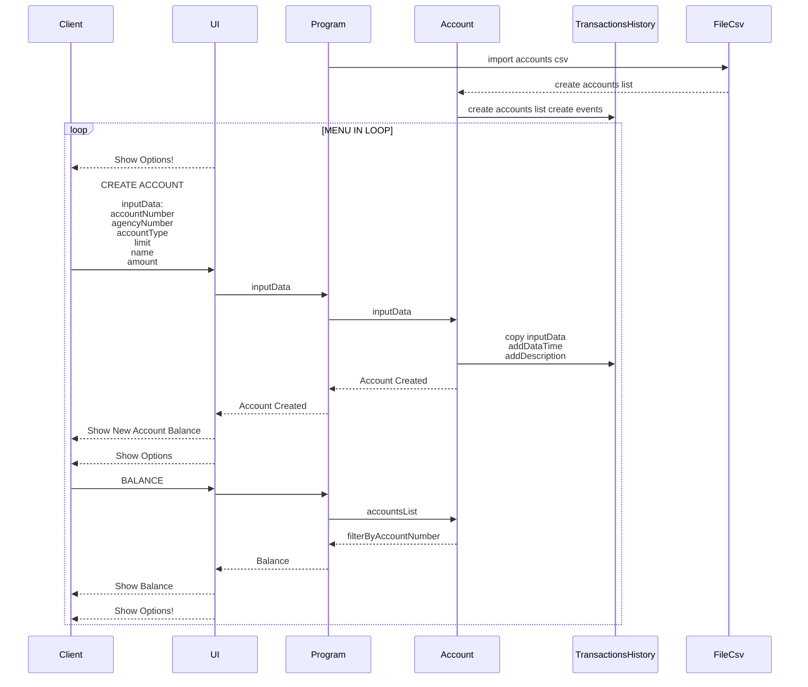
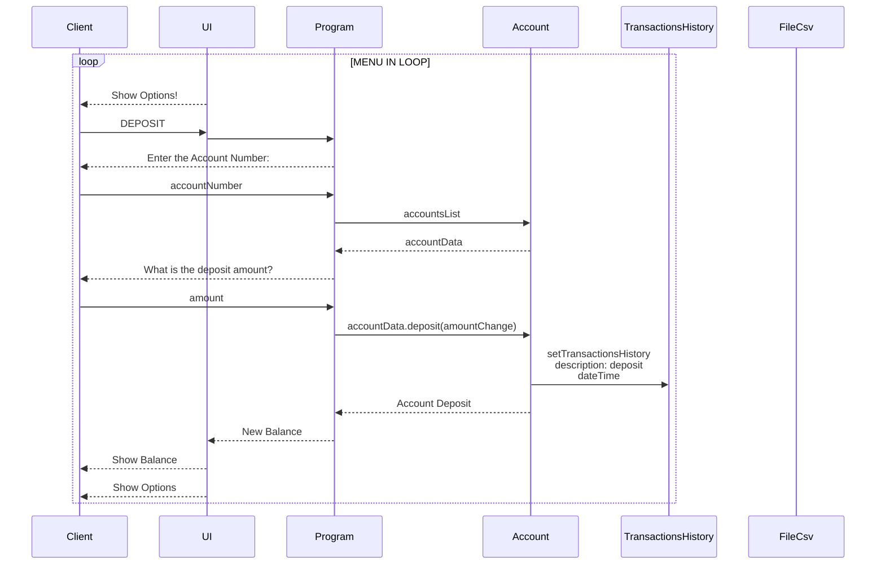
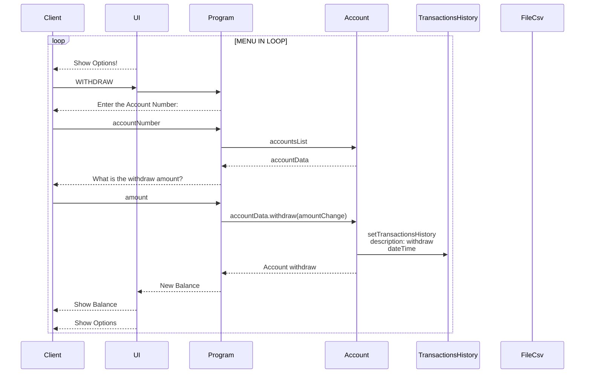
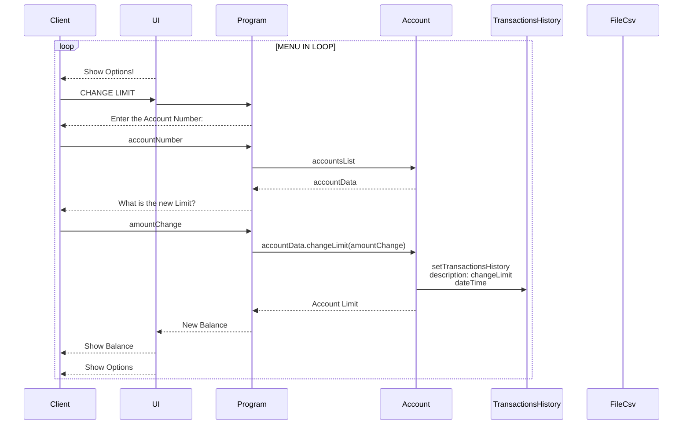
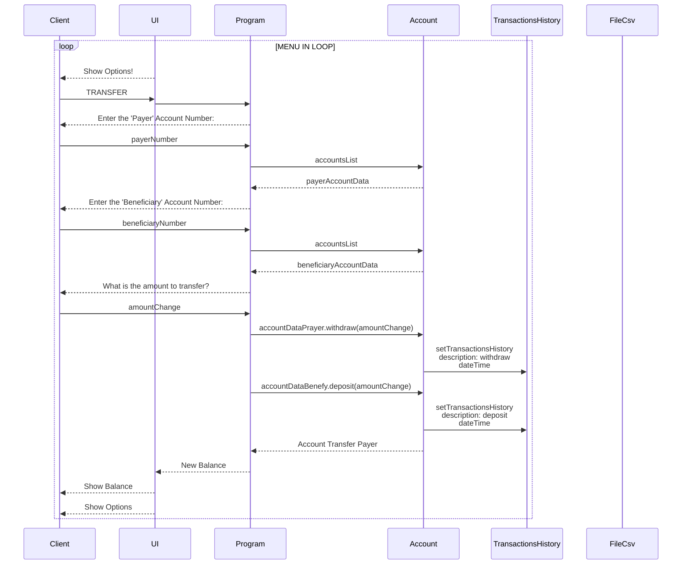
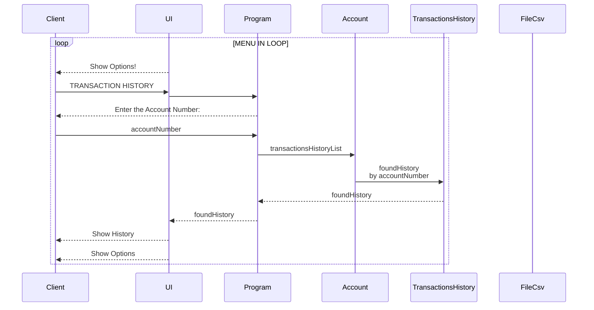
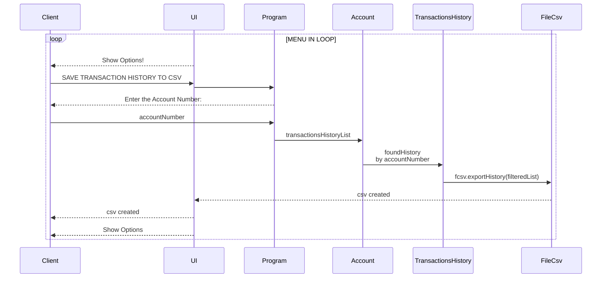
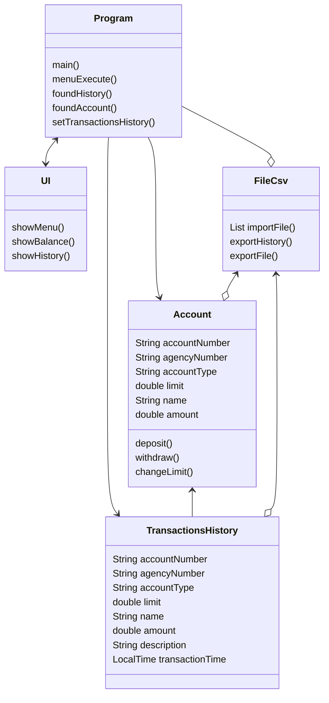

# renewjava01

## Instruções de Execução e operação da plicação

Aqui tem um programa de teste para um sistema bancário básico com funcionalidades como criação de contas, verificação de saldo, depósito, saque, transferência, histórico de transações e operações de salvamento e importação de dados em arquivos CSV.

Aqui está um resumo:

Configuração Inicial:
Instancia objetos para manipulação de arquivos CSV.
Cria listas para armazenar contas e histórico de transações.

Menu Principal:
Utiliza um loop while para exibir um menu de opções ao usuário até que ele decida sair.
O usuário pode escolher entre várias opções, como criar uma nova conta, verificar saldo, depositar, sacar, transferir, visualizar histórico de transações, salvar dados em arquivos CSV, entre outros.

Execução do Menu:
Cada opção do menu é implementada como um case em um switch.
Dependendo da opção selecionada, o programa executa a operação correspondente, como criar uma nova conta, verificar saldo, depositar, sacar, transferir, visualizar histórico de transações, salvar dados em arquivos CSV, entre outros.

Funções Auxiliares:
foundAccount: Localiza uma conta pelo número da conta.
setTransactionsHistory: Adiciona uma nova entrada no histórico de transações.

Gerenciamento de Transações:
As transações são registradas em uma lista de histórico de transações.
Cada transação é armazenada com informações como número da conta, tipo de conta, saldo, valor da transação, descrição e horário.

Entrada do Usuário:
O código utiliza a classe Scanner para obter entradas do usuário para várias operações, como criar conta, depositar, sacar, transferir, etc.

Exibição de Dados:
O código utiliza métodos da classe UI para exibir informações ao usuário, como saldo da conta e histórico de transações.

Manipulação de Arquivos CSV:
Os dados das contas e histórico de transações podem ser salvos e importados de arquivos CSV.

## Sequence Diagram

## Class Diagram 

